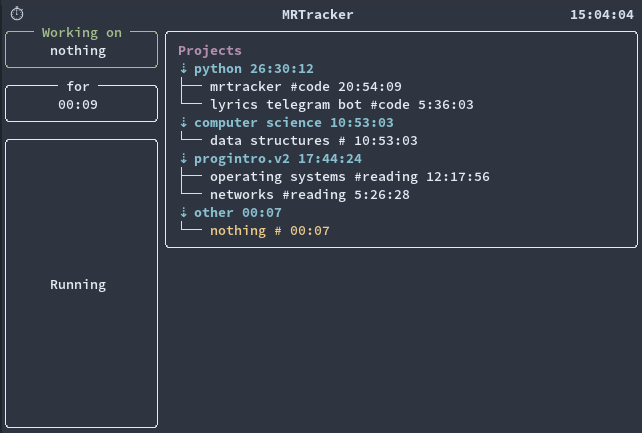

# MRTracker

[](https://lgtm.com/projects/g/markbragin/mrtracker/context:python)

MRTracker is a TUI time tracker.

## Installation

python3.10 is required.

You can install app using pip:
```bash
pip -m install mrtracker
```
or
```
python3.10 -m pip install mrtracker
```

## Usage

```bash
mrtracker
```

## Screenshot of the app


